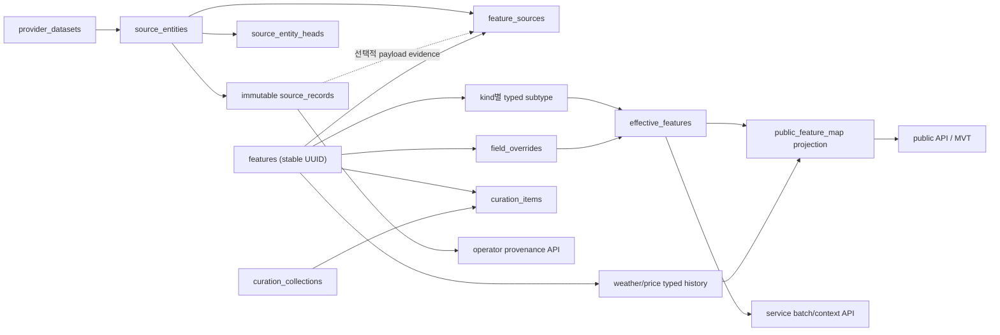

# 시스템 구조·DB·REST API 독립 리뷰

> 검토일: 2026-07-16
> `kor-travel-map`: `main` `9ef008b2343cdf7ee8569ac154387395f7ac11ea`
> PinVi: 원격 `main` `48085afb0606900081cde33c397588a910c84caf`

## 1. 결론

현재 시스템은 provider 원본을 보존하고 PostGIS로 조회하는 수집 시스템의 뼈대는 좋다. 그러나
공개 카탈로그, 서비스 간 조회, 관리자 기능, 운영 제어가 한 애플리케이션과 느슨한 상태 규칙 위에
겹쳐 있다. 그 결과 같은 Feature가 API에 따라 공개되기도 하고 숨겨지기도 하며, 설정 누락 시
운영 변경 API가 인증 없이 열리고, PinVi 여행 응답에 provider 원본 payload가 포함된다.

개발 단계이고 하위 호환성이 필요 없다는 전제에서는 기존 구조를 보완하는 것보다 다음 세 가지를
먼저 다시 잡는 편이 낫다.

1. Feature의 안정 식별자, 생명주기, 종류별 공간·상세 제약을 DB 정본으로 재설계한다.
2. 공개·서비스·관리자·운영 API를 별도 애플리케이션/권한/DB role로 분리한다.
3. PinVi가 실제로 필요한 지도·여행 카드·batch·날씨·cache target 경로를 전용 read model과
   명시적 상태 계약으로 제공한다.

현재 상태에서 provider나 화면을 더 늘리는 것은 권하지 않는다. 아래 P0를 배포 차단 조건으로,
P1을 다음 기능 확장 전 완료 조건으로 보는 것이 적절하다.

| 판정 축 | 결론 |
|---|---|
| 원본 수집·추적 | immutable source record 방향은 유지할 가치가 있음 |
| DB 정합성 | DTO가 보장한다고 가정한 제약이 DB에 빠져 있어 재설계 필요 |
| 공간 조회 | 인덱스 방향은 좋으나 공개 술어·geometry membership·hot projection이 불일치 |
| 공개 REST | 상태 판정, payload 경계, completeness 계약 때문에 현 상태로는 부적합 |
| PinVi 적합성 | 필요한 endpoint 외형은 있으나 여행 단위 조회와 실패 의미가 맞지 않음 |
| 운영 안전성 | 인증 fail-open과 legacy Dagster mutation 때문에 부적합 |

## 2. 검토 원칙과 범위

이 리뷰는 기존 ADR이나 호환 계약을 유지해야 한다는 전제를 두지 않았다. 시스템 목적에서 다음
불변식을 먼저 세우고 코드, SQLAlchemy metadata, Alembic migration, raw SQL, export된 OpenAPI,
PinVi의 실제 호출 경로를 역으로 대조했다.

- 공개 API는 게시 가능하고 유효한 Feature만 반환한다.
- provider 원본과 운영 계보는 보존하되 사용자 응답에는 필요한 정규화 projection만 반환한다.
- Feature identity는 행정코드·분류·표시 속성 변경에도 변하지 않는다.
- DB는 애플리케이션 DTO를 거치지 않는 write에도 같은 제약을 강제한다.
- 공간·검색·기간 조회는 결과 집합의 의미가 projection 옵션에 따라 바뀌지 않는다.
- service batch에서 `missing`, `retired`, `unchanged`, upstream `unavailable`은 서로 다른 상태다.
- PinVi는 통합 검색 UX/BFF와 Kakao·Naver 임의 POI provider 연동을 소유하고, 주소·지오코딩
  정본은 `kor-travel-geo`가 소유한다. `kor-travel-map`은 수집된 여행 catalog의 문자열·공간·기간
  검색과 최신 context를 소유한다.

DB 검토는 PostgreSQL 16/PostGIS scratch DB에 최신 Alembic head를 적용해 잘못된 row insert와
`alembic check`를 재현했다. 운영 데이터에 대한 `EXPLAIN (ANALYZE, BUFFERS)`나 부하 시험은
하지 않았으므로 latency 수치는 후속 성능 gate에서 검증해야 한다.

## 3. 유지할 설계

전면 재설계가 필요하더라도 다음 방향은 버릴 이유가 없다.

- `source_entities`와 immutable `source_records`를 분리하고 current record를 가리키는 개념
- WGS84 원본 geometry와 5179 metric projection, GiST를 이용한 반경 조회
- 시간순 대량 데이터에 BRIN을 사용하는 방향
- 목록 API의 keyset pagination과 RFC 7807 오류 형식
- PinVi가 DB나 Python package를 직접 사용하지 않고 OpenAPI HTTP 경계를 쓰는 구조
- Feature와 provider 원본을 분리해 정규화 projection을 만드는 방향

문제는 이 개념들이 하나의 정본과 제약으로 끝까지 연결되지 않았다는 점이다.

## 4. P0 — 배포 전에 반드시 고칠 항목

### P0-1. 공개·서비스·관리자·운영 권한 경계가 분리되지 않았다

공개 router 일부에는 API key dependency가 붙지만 curated router는 빠져 있고, legacy ops와
Dagster router는 인증 dependency 없이 mount된다. 인증 dependency가 빠진 curated 공개 route는
`admin_only` theme와 candidate/rejected/archived Feature까지 filter로 요청할 수 있고 단건도
published/public 상태를 강제하지 않는다. Dagster router에는 cron 변경, schedule
start/stop/reset/run mutation이 포함된다. 동시에 admin secret과 service token이 없으면 요청을
통과시키는 fail-open 동작이 기본이다.

근거:

- [`app.py`](../../packages/kor-travel-map-api/src/kortravelmap/api/app.py#L491)는 public router의
  dependency와 curated 예외를 보여 준다.
- [`app.py`](../../packages/kor-travel-map-api/src/kortravelmap/api/app.py#L628)는 legacy ops/Dagster를
  dependency 없이 mount한다.
- [`auth.py`](../../packages/kor-travel-map-api/src/kortravelmap/api/auth.py#L127)는 admin secret이
  없을 때 `local-dev`로 통과시키고, 같은 파일의 service token 검사도 미설정 시 통과한다.
- [`dagster.py`](../../packages/kor-travel-map-api/src/kortravelmap/api/routers/dagster.py#L95)는
  실제 상태 변경 endpoint를 포함한다.
- [`curated.py`](../../packages/kor-travel-map-api/src/kortravelmap/api/routers/curated.py#L781)는
  내부 visibility/status를 선택할 수 있는 route를 public router에 둔다.

영향은 단순 정보 노출이 아니다. 인증 설정 하나가 빠지면 외부 API quota, ETL 실행, DB 부하,
수집 schedule을 변경할 수 있다. prefix만 나누고 같은 listener에서 같은 fail-open 설정을 쓰는
것도 충분한 격리가 아니다.

권장 변경:

- `public-api`, `service-api`, `operator-api`를 별도 FastAPI app과 listener로 분리한다.
- 각각 read-only/public, PinVi service identity, admin/operator RBAC용 DB role을 사용한다.
- service/admin/operator credential이 없으면 해당 app은 시작하지 않는다.
- actor는 request body가 아니라 인증 principal에서만 얻는다.
- public key가 필요하면 URL query `key`가 아니라 header를 사용한다.
- public, service, operator OpenAPI를 각 app의 router 구성에서 직접 생성한다.

완료 기준은 인증 없는 모든 service/admin/ops 요청이 401/403이고, operator credential이 없는
운영 profile이 기동에 실패하며, public OpenAPI에 log·내부 target·Dagster mutation이 전혀 없는
것이다.

### P0-2. 공개 가능 상태가 endpoint마다 다르다

Feature에는 `status`와 `deleted_at`이 별도 정본처럼 존재하지만 결합 제약이 없다. provider 폐쇄
경로는 `inactive + deleted_at`을 기록하고 admin 비활성화는 `inactive`만 기록한다. bbox, search,
cluster는 주로 `deleted_at IS NULL`만 검사하고 nearby는 `active`를 기본으로 사용한다. 단건과
batch의 공개 판정은 `hidden`, `deleted`만 제외하므로 `draft`, `inactive`, `broken`도 공개된다.

근거:

- [`models.py`](../../src/kortravelmap/infra/models.py#L145)의 상태·삭제 시각에는 결합 CHECK가 없다.
- [`features.py`](../../packages/kor-travel-map-api/src/kortravelmap/api/routers/features.py#L487)의
  공개 판정은 두 상태만 숨긴다.
- [`feature_repo.py`](../../src/kortravelmap/infra/feature_repo.py#L687)의 bbox SQL은 일반 Feature에
  `status='active'`를 강제하지 않는다.
- [`features.py`](../../packages/kor-travel-map-api/src/kortravelmap/api/routers/features.py#L797)의
  nearby는 반대로 `active`를 기본 주입한다.

이 구조에서는 같은 Feature가 지도에는 보이고 주변 검색에서는 사라지거나, 검수 전 draft가
PinVi에 노출될 수 있다.

권장 변경:

- soft delete와 업무 상태를 한 enum에 섞지 않는다.
- `lifecycle_state(active, retired)`, `publication_state(draft, published, suppressed)`,
  `quality_state(valid, quarantined)`처럼 서로 직교하는 축만 저장한다.
- 공개 정본은 `publication_state='published' AND lifecycle_state='active' AND
  quality_state='valid'`인 `feature.public_features` view/projection 하나로 만든다.
- 공개 SQL과 partial index는 모두 이 정본만 사용한다.
- tombstone이 필요한 service batch는 별도 권한과 명시적 state로 제공한다.

상태별 fixture를 넣고 detail, bbox, tile, search, nearby, collection에서 동일한 visibility matrix를
검사해야 한다.

### P0-3. notice JSON 한 건이 공용 조회 전체를 500으로 만들 수 있다

공개 notice 필터는 `detail->>'valid_end_time'`을 `timestamptz`로 직접 cast하고 provider raw JSON과
lineage hash를 이용한 correlated anti-join을 모든 bbox/search/cluster/nearby/count에 붙인다.
scratch DB에서 `valid_end_time='garbage'`인 notice 한 건을 넣자 해당 필터가 timestamp cast 오류로
실패했다. 잘못된 row 하나가 광범위한 public read 장애가 되는 구조다.

근거는 [`feature_repo.py`](../../src/kortravelmap/infra/feature_repo.py#L440)의
`_PUBLIC_ACTIVE_NOTICE_FILTER_SQL`이다.

권장 변경:

- `feature.notice_states`에 typed `provider_dataset_id`, `source_entity_type`, `lineage_key`,
  `valid_during tstzrange`, `is_current`를 둔다.
- `(provider_dataset_id, source_entity_type, lineage_key) WHERE is_current`를 partial UNIQUE로
  강제한다.
- `is_current`용 partial B-tree와 `valid_during` GiST를 두고, 공개 notice는 runtime에
  `is_current AND valid_during @> now()`로 판정한다.
- hot path에서 JSON cast, raw payload hash 계산, lineage anti-join을 제거한다.

### P0-4. provider 원본 payload가 공개·여행 응답으로 전달된다

공개 `FeatureDetail`은 raw 주소·좌표, provider/source identity, payload hash, `raw_data`를 포함한
observation 전체를 반환한다. 단건, observation history, 200건 batch가 같은 DTO를 사용한다.
PinVi는 batch 결과 dict를 process cache에 넣고 여행 POI의 `feature` 필드로 그대로 반환하므로
단건 mapper의 정규화도 우회한다.

근거:

- [`features.py`](../../packages/kor-travel-map-api/src/kortravelmap/api/routers/features.py#L152)의
  `FeatureObservationView`
- [`features.py`](../../packages/kor-travel-map-api/src/kortravelmap/api/routers/features.py#L964)의
  공개 단건과 같은 파일의 batch
- PinVi [`trip_view_builder.py`](https://github.com/digitie/pinvi/blob/48085afb0606900081cde33c397588a910c84caf/apps/api/app/services/trip_view_builder.py#L120)
- PinVi [`trip.py`](https://github.com/digitie/pinvi/blob/48085afb0606900081cde33c397588a910c84caf/apps/api/app/schemas/trip.py#L199)의
  `feature: dict[str, Any]`

권장 변경:

- public detail은 kind-discriminated typed DTO만 반환한다.
- raw observation/current/history는 operator API의 `/features/{id}/sources`로 이동한다.
- service batch의 기본 projection은 `trip_card`로 고정하고, 필요한 field set만 허용한다.
- public OpenAPI 어디에도 `raw_data`, `raw_payload_hash`, `source_record_key`가 없어야 한다.
- PinVi도 `dict[str, Any]` 대신 생성된/공유된 typed response를 사용한다.

### P0-5. batch의 실패 의미와 opaque ID 계약이 깨져 있다

PinVi는 Feature ID를 `@` 앞에서 잘라 canonical ID로 간주한다. 그러나 Feature ID는 opaque여야 하며
revision이나 snapshot suffix는 별도 필드여야 한다. 더 심각하게 batch 호출이 timeout/5xx로
실패해도 예외를 삼킨 뒤 fresh 결과가 없는 모든 POI를 `is_broken=true`로 만든다. upstream 장애와
authoritative missing이 같은 사용자 상태가 된다.

근거:

- PinVi [`trip_view_builder.py`](https://github.com/digitie/pinvi/blob/48085afb0606900081cde33c397588a910c84caf/apps/api/app/services/trip_view_builder.py#L131)의
  batch fallback과 broken 판정
- 같은 파일의 [`_canonical_feature_id`](https://github.com/digitie/pinvi/blob/48085afb0606900081cde33c397588a910c84caf/apps/api/app/services/trip_view_builder.py#L272)

service batch는 요청 전체의 transport 상태와 item별 catalog 상태를 분리해야 한다.

```json
{
  "service_revision": "catalog-20260716-42",
  "items": [
    {"feature_id": "opaque-id-1", "state": "found", "revision": 42, "feature": {}},
    {"feature_id": "opaque-id-2", "state": "retired", "revision": 17, "feature": {}},
    {"feature_id": "opaque-id-3", "state": "missing"},
    {"feature_id": "opaque-id-4", "state": "unchanged", "revision": 9}
  ]
}
```

호출 자체가 실패하면 503이고 기존 snapshot을 `stale`로 사용해야 한다. 성공 응답의 `missing`일
때만 broken으로 바꾼다. `known_revisions`를 받으면 unchanged payload를 생략할 수 있다.

### P0-6. 해수욕장 품질·예보 옵션은 항상 빈 값을 반환한다

`include_quality`와 `include_forecast`의 true/false 양쪽에서 같은 `None`/빈 배열을 반환한다.
PinVi는 이를 실제 사용자 query로 다시 노출한다. 200 응답이므로 소비자는 데이터 부재와 기능
미구현을 구분할 수 없다.

근거:

- [`public_views.py`](../../packages/kor-travel-map-api/src/kortravelmap/api/routers/public_views.py#L305)
- PinVi [`public.py`](https://github.com/digitie/pinvi/blob/48085afb0606900081cde33c397588a910c84caf/apps/api/app/api/v1/public.py#L119)

실제 water quality/weather/index projection을 구현하지 않을 것이면 옵션과 필드를 지금 삭제해야
한다. 구현한다면 option이 true일 때만 enrichment query를 실행하고, seed data가 있을 때 실제
값이 반환되는 contract test가 필요하다.

## 5. P1 — 기능 확장 전에 재설계할 항목

### P1-1. Feature PK가 mutable 속성으로 구성된다

현재 Feature ID 생성은 행정코드, kind, category, source type/natural key를 포함한다. 역지오코딩
보정이나 분류 교정만으로 동일 장소의 PK가 바뀌고 구/신 Feature 정리와 redirect가 필요해진다.

권장 구조는 다음과 같다.

- `feature_id`: UUIDv7 또는 UUIDv4 안정 surrogate key
- provider natural identity: `source_entities`의 UNIQUE
- 외부에 표시할 canonical key/alias/redirect: 별도 테이블
- 행정코드, kind, category: 변경 가능한 속성

외부 소비자는 ID 문자열을 파싱하지 않고 그대로 저장·전달해야 한다.

### P1-2. Feature core가 JSONB monolith이고 종류별 공간 제약이 없다

`address`, `urls`, `detail`, `raw_refs`는 object/array shape CHECK도 없다. `coord POINT`, generated
`coord_5179`, generic `geom GEOMETRY`가 공존하지만 kind별 필수 geometry, `GeometryType`,
`ST_IsValid`, `ST_IsEmpty`, coord와 geometry anchor 관계를 강제하지 않는다. scratch DB에서는
route에 Point geometry를 넣고 coord와 geom을 약 325km 떨어뜨려도 저장됐다. 빈 ID/name/category,
scalar address, array urls, JSON `null` detail, object raw_refs도 모두 허용됐다.

권장 변경:

- core에는 안정 ID, kind, name, category FK, lifecycle/revision만 둔다.
- point/route/area subtype table 또는 `(feature_id, kind)` composite FK로 종류를 강제한다.
- route는 MultiLineString, area는 MultiPolygon, point kind는 Point만 허용한다.
- `ST_IsValid`, `NOT ST_IsEmpty`와 canonical anchor 생성 규칙을 DB에 둔다.
- place/event/notice의 filter·sort에 쓰는 필드는 typed subtype column/range로 승격한다.
- 남는 JSONB에는 최소 `jsonb_typeof` CHECK를 둔다.
- category는 자유 문자열이 아니라 `feature.categories`의 `(kind, code)` FK로 만든다.

### P1-3. `include_geometry`가 응답 필드가 아니라 결과 집합을 바꾼다

기본 bbox SQL은 representative `coord`가 bbox 안인 Feature만 고른다. geometry 포함 SQL은
route/area `geom && bbox`도 후보로 넣는다. 따라서 같은 query에서 projection flag 하나로 Feature
membership과 page 경계가 바뀐다. geometry 분기는 `&&`만 사용해 line/polygon MBR false positive도
허용한다.

권장 변경:

- 후보 술어는 option과 무관하게 한 곳에서 정한다.
- point는 point intersection, route/area는 `geom && envelope AND ST_Intersects(geom, envelope)`를
  사용한다.
- `include_geometry`는 serialization만 제어한다.
- 큰 geometry는 zoom별 단순화된 vector tile로 제공한다.

### P1-4. source lineage와 provider/dataset 정본이 중복된다

`source_records`는 `source_entity_key` FK를 가지면서 provider/dataset/type/natural ID를 다시 저장한다.
둘이 일치하는 composite FK가 없어 entity A에 provider B identity인 record를 연결할 수 있었다.
`source_links`도 `source_role`과 `is_primary_source`가 독립이며 서로 반대인 값이 허용된다.
provider/dataset 문자열은 sync state, policy, curation, weather/price에도 FK 없이 반복된다.

권장 구조:

```text
provider_datasets
  └─ source_entities
       ├─ source_records
       └─ source_entity_heads
```

- record에는 entity FK와 payload version/hash만 둔다.
- `(entity_id, payload_hash)`를 semantic UNIQUE로 둔다.
- current pointer는 별도 head table로 옮기고 `(entity_id, record_id)` composite FK로 같은 entity의
  record만 가리키게 해 entity↔record 순환 FK를 없앤다.
- primary는 `source_role` 한 필드만 정본으로 사용한다.
- provider/dataset은 `provider_datasets` composite FK로 통일한다.

### P1-5. provider base와 사용자 override가 whole-row 동결을 만든다

한 번이라도 `data_origin='user_request'`인 Feature는 이후 provider upsert에서 이름 한 필드뿐 아니라
좌표, 주소, 상세, 상태 등 거의 모든 필드를 기존값으로 보존한다. 동시에 field-level
`feature_overrides`도 있어 override 체계가 두 개다. 관리자 이름 수정 하나가 provider의 위치·폐업
갱신까지 영구 동결할 수 있다.

provider base projection, field-level override, effective projection 세 층으로 수렴시켜 수정된
field만 우선해야 한다. `features`에 user change 상태를 복제하지 말고 change request/history를
정본으로 두며 필요한 FK만 유지한다.

### P1-6. weather/price 의미와 제약이 비대칭이다

weather table은 DTO가 선언한 semantic identity UNIQUE가 없고 `source_record_key` FK도 아니다.
임의 `forecast_style`, 역전된 valid range, 중복 identity, 배열 payload, 존재하지 않는 source record를
모두 저장할 수 있었다. 반면 price에는 source FK와 semantic UNIQUE가 있다. 두 table 모두 부모의
kind가 weather/price인지 강제하지 않는다.

또 weather card는 `(forecast_style, metric_key)`별 가장 먼 미래 effective time을 고를 수 있고,
bbox marker는 현재와 가장 가까운 시각을 고른다. `asof` 조회도 해당 시점 뒤에 발행·수집된 예보가
섞일 수 있다.

권장 변경:

- observation, forecast, alert의 시간 의미를 별도 table 또는 명시적 conditional CHECK로 분리한다.
- weather identity tuple에 `UNIQUE NULLS NOT DISTINCT`를 적용한다.
- `valid_from <= valid_until`, payload object, source FK, subtype FK를 강제한다.
- `effective_at` generated column과 실제 card 정렬에 맞는 index를 둔다.
- current와 historical as-of 선택 규칙에 `issued_at`/`collected_at`을 포함한 bitemporal 의미를
  명시한다.
- 3천만 행이라는 이유만으로 즉시 partition하지 말고 retention·write/read 측정 후 월 partition
  또는 purge를 결정한다.

### P1-7. curation 정본이 두 개이고 동기화가 단방향이다

legacy `curated_features`와 신규 `curation_collections/items`가 title, summary, status, relation,
reuse policy를 중복 저장한다. migration trigger는 legacy에서 신규로만 동기화한다. 신규 API에서
collection/item을 수정하면 legacy에는 반영되지 않고, legacy row를 수정하면 collection을 강제로
`published`, `archived_at=NULL`로 되돌릴 수 있다.

호환성이 필요 없으므로 다음 cutover가 맞다.

- `curation_collections/items`만 write model로 남긴다.
- 후보가 필요하면 `theme_feature_candidates`를 명시적으로 분리한다.
- legacy table, repo, route, trigger, legacy snapshot FK를 같은 cutover에서 제거한다.
- archive 상태와 `archived_at` 결합 CHECK를 둔다.

### P1-8. POI cache target의 좌표와 provider scope가 손실된다

target은 `lon`, `lat`, `coord`, `coord_5179`, `coord_key`를 중복 저장하지만 상호 일치 제약이 없다.
서울 lon/lat과 부산 coord, 임의 coord key를 함께 저장할 수 있었다. link PK가
`(target_id, feature_id)`인데 provider/dataset도 같은 row에 저장하므로 multi-source Feature의
provider scope가 upsert 순서에 따라 마지막 하나로 덮인다.

PinVi의 POI create/update/delete는 현재 map cache target lifecycle과 연결되지도 않는다.

권장 변경:

- canonical 4326 point 하나만 write하고 lon/lat/5179/key는 generated projection으로 만든다.
- `target_feature_memberships`와 `target_feature_provider_scopes`를 분리한다.
- PinVi service identity에 namespace를 고정한 idempotent `cache-targets:sync` batch를 제공한다.
- PinVi는 transactional outbox로 upsert/delete generation을 전달한다.
- 동시 `on_conflict=reject`도 단일 atomic SQL 또는 lock으로 강제한다.

### P1-9. Alembic metadata가 실제 schema 정본이 아니다

Alembic은 `models.metadata`를 autogenerate 정본이라고 선언하지만 weather, price, system/API log,
public key, auth event 등 migration head의 table이 metadata에 없다. clean scratch DB에서
`alembic upgrade head` 후 `alembic check`를 실행하자 exit 255로 실패했고 해당 table들을
`remove_table`로 탐지했다. PostGIS 소유 object까지 drop 후보가 되고 entity↔record 순환 FK 정렬
경고도 발생했다.

모든 애플리케이션 소유 table을 metadata에 정확히 매핑하거나, 명시적 `include_object`로 소유권을
제외해야 한다. 새 baseline의 CI gate는 다음이어야 한다.

```text
빈 PostGIS DB → alembic upgrade head → alembic check(exit 0)
```

개발 단계라면 긴 compatibility migration graph 위에 추가 patch를 쌓지 말고 vNext schema를 새
baseline으로 만든 뒤 source data를 재적재하는 편이 안전하다.

### P1-10. 공간 인덱스와 일부 B-tree가 중복된다

scratch catalog에서 `coord`, `coord_5179`, `geom` 각각 GeoAlchemy 자동 full GiST와 수동 partial
GiST가 함께 생성되어 Feature write가 GiST 6개를 유지한다. source record identity UNIQUE의
left-prefix와 동일한 non-unique index, curated source UNIQUE와 동일한 index도 있다. 반대로 일부
FK는 parent delete를 위한 leading index가 없다.

`spatial_index=False`로 implicit GiST를 끄고 canonical public predicate에 맞는 partial index만
남겨야 한다. FK·중복 index audit를 catalog query로 CI에 넣되 실제 query plan과 delete 경로를
기준으로 선택해야 한다.

### P1-11. 지도 조회는 조용히 잘리고 hot path가 과도하게 비싸다

`/features/in-bounds`와 beach/festival marker는 `max_items`에서 결과를 자르지만 `truncated`, cursor,
coverage를 반환하지 않는다. cluster도 limit으로 잘리고 행정코드가 없는 Feature가 빠질 수 있다.
PinVi BFF도 bounded 결과에 completeness 표식을 추가하지 않으며 여행 지도는 300건을 요청한다.
일반 Feature 지도는 cluster를 렌더하지만
[`TripMapView`](https://github.com/digitie/pinvi/blob/48085afb0606900081cde33c397588a910c84caf/apps/web/components/trips/TripMapView.tsx#L144)는
같은 응답에서 `items`만 저장하므로 여행 지도는 낮은 zoom에서 결과가 사라진다.

일반 bbox SQL은 결과 행별 price/weather LATERAL 비용이 발생할 위험이 있고 같은 SQL이 geometry
옵션별로 복제되어 있다. 실제 호출 횟수는 `EXPLAIN (ANALYZE, BUFFERS)`로 확인해야 한다. 지도
hot path는 active Feature candidate를 먼저 제한하는 `public_feature_map` projection으로
수렴해야 한다.

권장 변경:

- 기본 지도 계약은 `GET /v1/public/tiles/features/{z}/{x}/{y}.mvt`로 만든다.
- JSON fallback은 반드시 `truncated`와 `next_cursor` 또는 명시적 coverage를 반환한다.
- cluster는 고정 grid/cell 기반 deterministic key와 drill-down 범위를 제공한다.
- current weather/price summary는 bounded read projection에 미리 반영한다.
- `include_geometry`와 관계없이 같은 candidate set을 사용한다.

### P1-12. search의 선택적 total과 cursor 계약이 실제 동작과 다르다

`include_total=false`여도 repository는 항상 별도 count query를 실행한다. pg_trgm 후보와 filter를
목록·count에서 두 번 계산하므로 PinVi 기본 검색도 전체 count 비용을 지불한다.

bbox cursor는 Feature ID만, search cursor는 query 존재 여부·score·ID만, nearby cursor는
sort key·ID만 담는다. 실제 q, bbox, origin, radius, kind/category가 바뀌어도 이전 cursor를
재사용할 수 있어 조용한 누락·중복이 생긴다. PinVi BFF는 그 cursor 자체도 최종 응답에서 버린다.

권장 변경:

- `include_total`을 repository까지 전달해 false면 count를 실행하지 않는다.
- cursor에 version, canonical query fingerprint, sort key, 필요하면 dataset snapshot revision을
  넣고 HMAC으로 서명한다.
- 다른 query와 함께 쓰면 `CURSOR_QUERY_MISMATCH`로 거부한다.
- PinVi는 cursor를 opaque하게 전달하고 `{items, next_cursor}`를 유지한다.

### P1-13. PinVi 여행 화면에 맞는 context batch가 없다

PinVi는 현재 활성 날짜에서 날씨 표시가 켜지고 Feature ID와 날짜가 있는 POI마다
`GET /features/{id}/weather?asof=...`를 호출하며, 첫 POI 날씨는 날짜 요약 영역에서 한 번 더
요청한다. 지도 popup도 detail과 weather를 두 요청으로 호출한다. 현재 weather/price endpoint는
부모 Feature의 존재·공개 상태·kind도 확인하지 않아 임의 또는 삭제된 ID에 빈 200을 반환할 수
있다.

근거:

- PinVi [`TripWeatherSummary.tsx`](https://github.com/digitie/pinvi/blob/48085afb0606900081cde33c397588a910c84caf/apps/web/components/trips/TripWeatherSummary.tsx#L123)
- PinVi [`TripPoiList.tsx`](https://github.com/digitie/pinvi/blob/48085afb0606900081cde33c397588a910c84caf/apps/web/components/trips/TripPoiList.tsx#L200)
- PinVi [`FeatureMapView.tsx`](https://github.com/digitie/pinvi/blob/48085afb0606900081cde33c397588a910c84caf/apps/web/components/map/FeatureMapView.tsx#L322)

`POST /v1/service/feature-context:batch`가 `{feature_id, target_at, include}` 배열을 받고 typed trip
card와 weather/price/event context를 한 번에 반환해야 한다. DB query 수는 item 수와 무관하게
bounded해야 한다. 단건 weather/price는 public Feature를 먼저 확인하고 없으면 404를 반환한다.

### P1-14. 관리자 write에 idempotency와 낙관적 동시성 계약이 부족하다

PinVi admin client는 timeout/5xx를 재시도하지만 create idempotency는 선택적이고 PATCH/DELETE에
`If-Match`가 없다. commit 뒤 응답이 유실되면 중복 명령이 생기고, 두 운영자의 write는 마지막
요청이 앞선 변경을 덮을 수 있다.

- command POST에는 `Idempotency-Key`와 request hash/result 저장을 필수화한다.
- 같은 key·같은 body는 같은 결과, 같은 key·다른 body는 409로 처리한다.
- PATCH/DELETE는 `If-Match: <revision>`을 필수화하고 누락 428, stale 412를 반환한다.
- 검수 queue면 202와 `Location`, 즉시 생성이면 201을 사용한다.

### P1-15. cache와 OpenAPI profile이 representation 정본을 보장하지 않는다

KTM API에는 `ETag`, `If-None-Match`, `Last-Modified`, `Cache-Control` 처리가 없고 매 응답 body의
`duration_ms`, `request_id`가 달라진다. categories, Feature detail, curation, public view처럼 반복
조회되는 resource가 conditional cache를 사용할 수 없다.

또 user OpenAPI는 하나의 full app에서 29개 operation을 수기 allowlist로 뽑는다. 실제 full spec은
159개 operation이다. 수기 목록에는 raw observation history와 no-op beach option이 들어가고 다른
public route는 빠질 수 있다.

근거:

- [`response.py`](../../packages/kor-travel-map-api/src/kortravelmap/api/response.py#L68)
- [`export_openapi.py`](../../packages/kor-travel-map-api/scripts/export_openapi.py#L47)

권장 변경:

- request ID와 duration은 header/metrics로 이동한다.
- detail은 revision 기반 ETag, category는 catalog revision ETag, tile/public view는 dataset revision
  기반 cache header를 제공한다.
- 304 처리와 service batch `known_revisions`를 지원한다.
- OpenAPI는 별도 public/service/operator app에서 생성하며 allowlist pruning을 없앤다.
- PinVi는 commit-pinned spec 복사와 수기 dict mapper 대신 생성 client/typed DTO를 사용한다.

## 6. 권장 목표 구조



핵심은 write model과 read model을 구분하되 각각 하나의 정본만 갖는 것이다.

### 6.1 권장 schema 요약

| 영역 | 정본 | 주요 제약·인덱스 |
|---|---|---|
| Feature core | 안정 UUID, kind, category FK, revision, 직교 상태 | non-empty, 상태/timestamp CHECK, category-kind FK |
| 공간 subtype | canonical 4326 geometry와 generated anchor/5179 | kind별 geometry type, validity, partial GiST |
| provider | provider dataset → entity → immutable record → head | semantic UNIQUE, FK, 순환 참조 없음 |
| effective 값 | provider base + field override | field path UNIQUE, revisioned projection |
| notice/event | typed range와 lineage | range CHECK, current partial UNIQUE, GiST |
| weather/price | typed history와 current projection | semantic UNIQUE, source/subtype FK, effective-time index |
| curation | collections/items | legacy overlay 없음, archive 결합 CHECK |
| POI target | canonical point, membership, provider scope | external identity UNIQUE, generated coord fields |
| 공개 조회 | `public_feature_map` | 공개 partial GiST/trgm, bounded current summaries |

### 6.2 권장 REST surface

```text
public-api
  GET  /v1/features/{feature_id}
  GET  /v1/features/search
  GET  /v1/features/nearby
  GET  /v1/tiles/features/{z}/{x}/{y}.mvt
  GET  /v1/categories
  GET  /v1/collections
  GET  /v1/collections/{collection_id}

service-api
  POST /v1/features:batchGet
  POST /v1/feature-context:batch
  POST /v1/cache-targets:sync
  POST /v1/refresh-requests
  GET  /v1/refresh-requests/{request_id}

operator-api
  /v1/features/{feature_id}/sources
  /v1/features/{feature_id}/observations
  /v1/feature-change-requests
  /v1/provider-datasets
  /v1/pipelines
  /v1/schedules
  /v1/logs
```

`kor-travel-map`의 search는 수집된 catalog Feature에 대한 문자열·공간·기간 facet만 담당한다.
Kakao/Naver 임의 장소 검색은 PinVi가 직접 연동하고 주소·지오코딩 정본은 `kor-travel-geo`가
담당하므로 KTM이 이를 proxy하지 않는다. 해수욕장·축제 전용 API는 실제로 다른 typed projection이나
SEO 상품이 필요할 때만 유지하고, 단순 필터라면 generic catalog query와 collection으로 흡수한다.

refresh는 동기 mutation이 아니라 `202 Accepted + Location`의 operation resource로 만들고
idempotency key, dedupe 결과, rate policy, 진행 상태를 명시한다.

## 7. PinVi 기능별 최종 판정

| 사용자 기능 | 현재 판정 | 목표 |
|---|---|---|
| 지도 viewport | silent truncation과 여행 지도에서의 cluster 폐기 때문에 부적합 | MVT/cell cluster + completeness |
| catalog 검색 | 기본 기능은 있으나 count/cursor/BFF metadata 문제 | typed catalog search + opaque cursor |
| 주변 장소 | 공간 인덱스 방향은 적합 | 공개 상태 통일 + cursor 보존 |
| 여행 snapshot 복원 | raw payload·장애 오판 때문에 부적합 | projection batch + item state/revision |
| 여행 날짜별 날씨 | 활성 날짜의 표시 대상 POI 수만큼 호출되어 부적합 | target time을 받는 context batch |
| 가격·행사 기간 | PinVi 주요 projection에서 소실 | trip/map card에 typed context 포함 |
| 해수욕장 품질·예보 | 미구현인데 성공 응답 | 실제 구현 또는 계약 삭제 |
| 축제 월별 목록 | 기본 기능은 적합 | 기간 range 정본과 completeness 추가 |
| POI 기반 targeted refresh | lifecycle 연결이 없어 미완성 | outbox + cache-target sync + operation API |
| 관리자 변경 | 재시도·동시 수정 안전성 부족 | idempotency + `If-Match` |

PinVi의 현재 `GET /search`는 구현돼 있지만 source bucket이 여전히 `dict[str, Any]`다. 최신 계획의
source-tagged typed replacement와 kind-discriminated detail card는 아직 구현되지 않았다. 이 detail
projection을 PinVi BFF에서 다시 정의하기보다 KTM public/service API가 정본 typed card를 제공해야
수기 mapper와 raw batch 우회를 함께 없앨 수 있다.

## 8. 권장 실행 순서

호환 layer와 dual-write 기간을 만들지 않는 순서다.

1. **즉시 차단**: legacy ops/Dagster mutation 인증, public `active` 규칙, raw observation 공개,
   no-op beach option을 우선 닫는다.
2. **vNext DB 생성**: 안정 UUID, provider lineage, typed subtype/range, collection/item, POI target을
   새 schema에 만들고 새 Alembic baseline을 만든다.
3. **일회성 이관**: 보존 가치가 있는 curation/admin override만 검증 이관하고 provider data는
   source에서 재적재한다. legacy table과 trigger는 같은 cutover에서 제거한다.
4. **read projection 구축**: `effective_features`, `public_feature_map`, current weather/price를 만든다.
5. **API 분리**: public/service/operator app과 OpenAPI를 생성하고 PinVi generated client를 갱신한다.
6. **PinVi cutover**: batch 상태, context batch, cluster/tile, target outbox를 한 번에 전환한다.
7. **성능 검증 후 제거**: 구 endpoint/schema를 삭제하고 중복 index를 정리한다.

## 9. 검증 gate

### 9.1 DB 정합성

- 빈 ID/name/category, scalar address, array urls, null detail, object raw refs가 모두 거부된다.
- 상태와 lifecycle timestamp의 불가능한 조합이 거부된다.
- route Point, invalid/empty polygon, coord-anchor 불일치가 거부된다.
- source entity와 다른 provider/dataset의 record 연결이 거부된다.
- primary role이 하나의 정본으로 강제된다.
- weather semantic duplicate, 역전 range, 잘못된 source FK가 거부된다.
- category-kind와 행정코드 prefix 불일치가 거부된다.
- `alembic upgrade head && alembic check`가 빈 DB에서 exit 0이다.

### 9.2 API 계약

- 모든 public route가 같은 visibility matrix를 사용한다.
- public schema와 payload에 raw provider field가 없다.
- service batch가 found/retired/missing/unchanged를 구분한다.
- 503에서 PinVi snapshot은 stale이며 broken으로 바뀌지 않는다.
- `@`를 포함한 opaque Feature ID가 byte-for-byte 보존된다.
- 다른 query의 cursor가 명시적으로 거부된다.
- `include_total=false`에서 count SQL이 실행되지 않는다.
- 미구현 expansion은 OpenAPI에 없거나 명시적 오류를 반환한다.
- stale `If-Match`는 412, idempotent retry는 한 개의 operation만 만든다.
- conditional GET은 같은 revision에서 body 없는 304를 반환한다.

### 9.3 성능

현재 일부 성능 테스트는 약 3,200 Feature, `enable_seqscan=off`, `EXPLAIN`만 사용해 index 존재를
확인하는 수준이다. 다음 gate로 바꿔야 한다.

- 목표 분포를 반영한 100만+ Feature와 실제 규모 weather/price fixture
- planner 기본값에서 `EXPLAIN (ANALYZE, BUFFERS)`
- 서울 밀집 viewport, 전국 low zoom, 주변 100km, 흔한 검색어, 200건 trip batch
- query 수가 batch item 수에 비례하지 않는지 검사
- p95 latency, shared buffer read, response byte budget을 target hardware 기준으로 고정
- write benchmark에서 중복 GiST 제거 전후 insert/upsert 비용 비교

## 10. 피해야 할 보완 방식

- endpoint마다 `status='active'`를 따로 덧붙이는 방식
- legacy curation과 신규 collection을 trigger로 계속 dual-write하는 방식
- monolithic detail에 `include_*` option을 계속 추가하는 방식
- PinVi BFF에서 upstream typed contract를 다시 수기 정의하는 방식
- JSONB hot field마다 GIN index만 추가하고 shape 제약을 두지 않는 방식
- 실측 없이 weather table부터 partition/hypertable로 바꾸는 방식
- 한 FastAPI app에서 prefix와 optional secret만으로 public/admin/ops를 구분하는 방식

최종적으로 필요한 것은 endpoint 수를 늘리는 일이 아니라, 하나의 공개 Feature 정본과 목적별로
작고 명시적인 projection을 만드는 일이다. 그 구조가 잡히면 PinVi의 지도, 여행 카드, 날씨,
targeted refresh는 더 적은 query와 더 작은 payload로 구현할 수 있다.

---

## 11. 다양한 관점의 보강 리뷰 (2026-07-16 추가)

> 보강 검토자: 별도 5개 관점(DB/스키마, API 보안·계약, PinVi 연동, 성능·공간쿼리,
> 실행 전략·현실성)에서 §1~§10의 각 주장을 **실코드·실 DDL로 재대조**하고, 가능한 곳은
> `postgis/postgis:16-3.5` scratch DB에서 EXPLAIN/insert 반례를 재현했다. 기준 커밋은
> 원 리뷰와 동일한 `main@9ef008b2`이며, 대상 코드는 현재 `origin/main`과 byte-identical임을
> 확인했다(그 사이 diff는 원 리뷰 문서 1건뿐).

### 11.0 종합 판정

- **결함 진단(§4 P0·§5 P1)의 사실관계는 대부분 확증된다.** 특히 DB 10개 항목·API 보안
  다수(P0-1c Dagster mutation 무게이트, P0-4 raw_data 공개, P0-6 삼항 양분기 동일값,
  P1-12 무조건 count, P1-15b 29 vs 159 operation)·성능(include_geometry membership 변경,
  `&&`-only MBR false positive, 매행 LATERAL, GiST 6개)은 근거가 결정적이다.
- **그러나 §8 실행 전략(호환 layer 없는 vNext 새 baseline + 전량 재적재 + legacy 동시 제거)은
  이 운영 현실에서 채택하면 안 된다.** 목표 구조(§6)는 유지하되 도달 경로를 parallel-change로
  바꿔야 한다. 이것이 가장 큰 이견이다(§11.5).
- 원 리뷰가 **정정·과장한 지점 5건**과 **놓친 이슈 다수**가 확인됐다(§11.6 종합표).

### 11.1 DB/스키마 관점

- **확증(정정 없음)**: P0-2(status·deleted_at 결합 CHECK 부재 — 실제로는 `status='deleted'`·
  `deleted_at`·`user_deleted_at`·`user_change_status`로 **삭제/상태 축이 사실상 4중**), P1-1
  (`core/ids.py:149-152`가 bjd|kind|category|source를 해시 — docstring이 "bjd 변경 시
  feature_id 변경"을 **의도된 동작으로 자인**), P1-2(4개 JSONB `jsonb_typeof` CHECK 없음, `geom`은
  `Geometry("GEOMETRY")`라 route에 Point·한국 밖·325km 이격 저장 가능), P1-5(upsert의
  거의 전 열이 `user_request` whole-row 동결), P1-6(weather는 semantic UNIQUE·source FK·range
  CHECK 전무, price는 보유 — 비대칭 확증), P1-9(weather/price/log/api-key/auth-event **6개 table이
  `models.metadata`에 없음**, `env.py`에 `include_object` 콜백 없어 `alembic check`가 PostGIS
  object까지 drop 후보로 잡음), P1-10(coord·coord_5179·geom 각각 자동 full GiST + 수동 partial =
  **6개**, `0009`는 ops table에 `spatial_index=False`를 명시해 함정을 인지하면서 features엔 미적용).
- **정정 2건**: (a) **P1-4** — 원 리뷰가 "current pointer composite FK가 없다"고 했으나 ADR-063으로
  `source_entities.(source_entity_key, current_source_record_key)→source_records` **deferrable
  composite FK가 이미 존재**해 current-record cross-entity는 차단된다(다만 record denorm 식별자
  미정합·순환 FK·`provider_datasets` 부재는 그대로). (b) **P1-8** — `coord_5179`는 coord로부터
  **generated STORED**라 coord와 정합하다. 불일치 위험은 lon/lat/coord_key에 한정.
- **보강**: ① `coord_5179` STORED generated의 **PROJ 버전 재현성 함정**(EPSG:5179 파이프라인
  버전업 시 기존 저장값 ≠ 신규 write값, table rewrite 없이는 재계산 안 됨) — vNext에서 5179를
  generated로 둘지 재검토. ② 순환 FK가 **deferrable로만 봉합**돼 §8의 "source 재적재"가 단순
  COPY로 안 끝난다. ③ `provider_datasets` canonical table이 아예 없어 provider/dataset 문자열이
  최소 9개 table에 흩어져 FK화 표면이 매우 넓다. ④ price payload도 `jsonb_typeof` CHECK 없음
  (P1-6의 "price는 낫다"가 불완전). ⑤ `features.user_change_request_id`가 dangling UUID(FK 없음).
  ⑥ Alembic graph가 이미 분기·merge(`0034` 중복번호·`0035_merge`) 누적 — P1-9의 "긴 graph 위에
  patch 금지"를 실증으로 뒷받침.
- **이견**: 안정 UUID 전환(P1-1)은 방향은 옳으나 파급이 크다 — `_canonical_notice_feature_sql`이
  **feature_id를 raw SQL 안에서 sha1로 재계산**하므로 UUID 전환 = 전 feature 재키잉 + PinVi 저장
  ID 무효화 + notice-lineage SQL 전면 재작성. **결정적 자연키를 indexed alias로 보존하고 UUID를
  병행 surrogate로 도입**하는 편이 안전(§8 big-bang이 아니라 additive). P1-2/6 대다수 제약은
  `ADD CONSTRAINT … NOT VALID → 배경 VALIDATE`로 **재적재 없이** 강제 가능. weather 유일성은
  `NULLS NOT DISTINCT`보다 **tuple에서 파생한 generated key/컬럼 UNIQUE**가 더 견고. partition
  유보(실측 후 결정)에는 동의.

### 11.2 API 보안·계약 관점

- **중요 시점 보정**: 원 과제가 "그 사이 ADR-064 게이트가 추가돼 부분 해소됐을 것"이라 전제했으나,
  `require_admin_frontend`·`ops_datasets`·`ops_pipeline` 게이트는 **원 리뷰가 검토한 바로 그
  커밋(9ef008b2)에 이미 존재**했다. 코드 diff는 리뷰 문서 1건뿐 → "문서 시점→현재 해소" 서사는
  성립하지 않는다. 아래 판정은 doc-time=current 동일 코드 기준.
- **확증**: P0-1c(legacy `ops`/`ops_live`/`dagster` router가 `app.py:628-632`에서 **dependency
  없이 mount**, `dagster.py`에 cron PATCH·start/stop/reset/run mutation — app·route 양쪽 게이트
  부재), P0-1d(admin secret/service token/public key **3개 기본값 모두 permissive** — 미설정 시
  통과), P0-4(`FeatureObservationView`에 `raw_data`/`raw_payload_hash`/`source_record_key` — 공개
  단건·200-batch·observation history가 동일 DTO 재사용), P0-6(`public_views.py:356-358` 삼항 양
  분기가 동일 `None`/`[]`), P1-12a(`search_features`에 `include_total` 파라미터 자체가 없고 count
  무조건 실행), P1-15b(`USER_OPERATIONS` 정확히 29개 vs full 159 — raw observation·beach no-op
  포함, allowlist가 신규 public route 자동 편입 안 함).
- **정정(과장) 1건**: P0-1 산문의 "admin 라우터도 prefix만 나뉜 채 무인증"은 과대 — admin
  라우터는 이미 전부 `require_admin_frontend` 게이트됨. 실제 결함은 **(i) 세 게이트의 기본값
  fail-open** + **(ii) legacy `curated`/`ops`/`dagster` 3개 라우터의 게이트 배선 누락**이다.
- **보강**: ① API 계층에 **HTTP rate limit 전무**(공개 검색/nearby/batch 무제한 — P1-11 hot-path와
  결합 시 단일 N150 DoS). ② 공개 key가 **URL query(`key=`)** 로 전달돼 uvicorn access log·Referer에
  잔류. ③ 앱 전역 단일 CORS(`allow_methods/headers=["*"]`)를 public/admin/ops가 공유. ④ 반대로
  **problem+json 일관성·stack 미노출은 오히려 양호**(#510) — §1의 우려와 달리 "유지할 설계"에
  넣어야 함(단 422가 pydantic `loc/msg/type` 노출은 소소한 정보 누출). ⑤ `admin_destructive_enabled`
  기본 True. ⑥ actor가 인증 principal이 아니라 헤더에서 와 신뢰 CIDR 안에서 **위조 가능**(감사 로그
  신뢰성 약화).
- **이견**: **3-app 물리 분리(별도 listener/DB role)는 단일 N150 운영에 과중.** surface별
  dependency는 이미 분리돼 있고, 배포 차단의 실질은 물리 분리가 아니라 **(1) production profile에서
  secret 미설정 시 기동 실패(fail-closed 전환) + (2) 누락된 3개 라우터에 dependency 배선**이다 —
  이 둘이면 완료 기준의 90%를 단일 app에서 충족. 별도 read-only DB role은 가치 있음. **If-Match보다
  Idempotency-Key가 우선**(PinVi가 5xx 재시도하므로 create 중복이 실발생, If-Match는 운영자 2인
  규모에서 편익 낮음 + 이미 검수 큐가 대부분 mutation을 비동기화). OpenAPI drift는 3-app 없이
  **역방향 검사**(public prefix 신규 route → allowlist 강제 or CI fail)로 해소.

### 11.3 PinVi 연동 관점

- **확증**: P0-5a(batch가 timeout/5xx 예외를 삼키고 fresh 없는 **전 POI를 broken**으로 —
  `trip_view_builder.py:152-167`, `missing` 배열조차 안 읽음), P1-11(여행 지도 `TripMapView.tsx`가
  `data.clusters`를 버리고 `items`만 저장 → 저zoom 소실; 대조군 `FeatureMapView`는 둘 다 렌더),
  P1-13(POI마다 `weather?asof=` N+1 + 단건 weather가 **부모 미검증으로 삭제 ID에 빈 200**).
- **정정(반증) 2건**: (a) **P0-5b `@` 절단** — 실 KTM feature_id는 `f_{bjd}_{kind}_{sha1}`로 `@`가
  없고, `@raw` suffix는 PinVi **자체 snapshot 규약**(요청·응답에 대칭 적용)이라 프로덕션 KTM ID엔
  무해한 방어 코드다. "계약이 깨져 있다"는 **잠재 스멜이지 능동 결함 아님**(과장). (b) **P0-5c** —
  KTM은 **retired vs missing을 이미 구별해 준다**: `get_feature_rows_by_ids`가 D-12에 따라 inactive
  feature를 status와 함께 반환하고 `FeatureDetailResponse`에 `status`·`updated_at`이 이미 있다.
  **PinVi가 `status`를 안 읽을 뿐**(오히려 retired를 정상 live로 표시). 실제 부재는 `unchanged`
  /revision-delta/요청단위 `service_revision`뿐.
- **보강**: ① PinVi 계약 pinning이 **path-level 집합 동등성만** 검사해(`test_kor_travel_map_contract.py`)
  KTM이 `found`/`missing` 의미나 `status` enum을 바꿔도 게이트가 green — 필드-레벨 계약 단언 필요.
  ② outbox 신설은 KTM에 **이미 있는 `feature_update_requests` lifecycle과 이중화** — POI 이벤트를
  기존 request enqueue에 배선하는 편이 안전. ③ KTM 장애가 표면마다 다른 상태(공개 503·여행
  false-broken·지도 silent-empty)로 나타남 — degrade 표현을 표면 공통 규정 필요. ④ `feature-context:batch`가
  `target_at`을 넘기면 **asof 버킷팅/타임존 라운딩 책임이 경계를 넘어가** 새 계약 버그 소지(target_at
  의미 명시 필요).
- **이견**: **P0-5의 핵심 결함은 PinVi-side 2줄 + 이미 계약된 `status` 소비로 닫힌다** —
  (a) batch 전체 실패 시 broken 대신 stale 유지, (b) `status=='inactive'`를 retired 배지로. `service_revision`
  /`known_revisions`/state-envelope 재설계는 P0 종료의 전제 아님. P1-13b도 KTM 단건 weather에
  **부모 404만 추가**하면 닫힘 — `feature-context:batch` 신설 불요. §7 "부적합" 판정 다수는
  하향 필요: "여행 날씨"는 작동하며 N+1 **최적화** 대상이지 정합성 결함 아님, "targeted refresh"는
  primitive가 이미 존재해 **미완성 아닌 배선 필요**, "관리자 변경"은 create 멱등이 이미 있어 갭은
  correction PATCH/DELETE의 If-Match뿐.

### 11.4 성능·공간쿼리 관점 (라이브 EXPLAIN 재현)

- **확증(EXPLAIN 재현)**: P1-3(include_geometry가 candidate 술어를 바꿔 **membership 변경** — 동일
  envelope 2220→2221행; `&&`-only라 L자 polygon **MBR false positive** 실재), P1-11(공개
  `in-bounds`는 `truncated`/cursor 없이 silent 절단 — debug 경로만 cursor 반환; 매행 LATERAL이
  `ON f.kind=...`로 가지치기 안 돼 **place 행도 매행 price/weather probe 실행**), P1-12b(cursor가
  q 텍스트·bbox·origin/radius·filter를 안 담아 다른 query 재사용 시 조용한 누락/중복), P1-6 후반
  (card는 가장 먼 미래 effective time, marker는 now 최근접 — 같은 feature 두 화면 상이; asof가
  `valid_at`만 바운드하고 `issued_at`은 안 해 **미래지식 누수**), P1-10(GiST 6개).
- **정정(부분과장) 1건**: §9.3의 "현재 테스트는 `enable_seqscan=off`만" — 실제로는 3개 케이스가
  `force_index=False`(planner 기본)로 기본 planner의 GiST 선택을 검사한다. 다만 100만행·ANALYZE·p95
  부재라는 핵심 지적은 유효.
- **보강**: ① **write-amplification 실측** — 150k place insert가 partial 3-GiST 1966ms vs 6-GiST
  3179ms(**~1.6×**); geom이 전부 NULL인데도 full GiST가 5.8MB 저장(쿼리 이득 0). ② `ORDER BY
  feature_id + LIMIT`가 **저선택도 뷰포트에서 GiST를 무력화**(planner가 PK scan + coord filter 선택)
  — N150 기본값에서 더 강해짐. 이게 §9.3의 "planner 기본 EXPLAIN ANALYZE"가 필요한 이유. ③ 시간상관
  table엔 partition 이전에 **BRIN-on-time**이 값싼 선행 단계(공간축은 GiST 유지). ④ admin dedup/enrichment
  목록이 잔여 **OFFSET 페이징**(깊은 페이지 O(n)). ⑤ notice lineage 필터가 모든 공개 read의 상시
  hot-path 비용(§9 fixture에 notice 밀집 시나리오 필요).
- **이견**: **MVT tile 서버는 과함** — 실 사용처가 여행 지도 300건·popup 단건이므로, 병목은 tile
  부재가 아니라 `truncated`/`next_cursor` 미반환 + PinVi가 cluster를 버리는 것. **JSON 3필드
  추가 + 기존 `cluster_features_in_bbox` 재사용**(하루 작업)으로 실질 위해 해소. **`public_feature_map`
  전면 projection보다 좁은 `current weather/price summary` 테이블**로 두 LATERAL을 LEFT JOIN 치환 —
  P1-3(candidate 술어 통일)과 함께 **단일 패치로 수렴**. **cursor HMAC은 오버킬**(cursor에 인가가
  실리지 않으므로 **fingerprint + version byte** + `CURSOR_QUERY_MISMATCH`면 충분). §9.3의 100만
  fixture·p95를 **매 PR CI에 박는 건 과부하** — CI는 planner-기본 EXPLAIN 스모크 확대, 100만+ p95는
  릴리스 게이트 1회성으로 **계층화**(이 repo의 e2e/heavy가 CI 게이트가 아닌 관례와 정합).

### 11.5 실행 전략 이견 (핵심)

원 리뷰의 **가장 큰 문제는 전제와 실행 순서**다. §1은 "개발 단계·하위 호환 불필요", §8은
"호환 layer/dual-write 없는 순서"를 명시적으로 깐다. 이 전제는 저장소 현실과 충돌한다.

- **(전제 붕괴)** `docs/integration-map.md` §2는 **PinVi가 이미 prod에서 `/v1/features*`·
  `curated-features`·`weather/*`를 pull 중**임을 정본으로 못박는다. 소비자가 라이브인 순간
  **사실상의 호환 계약**이 존재한다. "하위 호환 불필요"는 선택할 수 있는 정책이 아니라 PinVi를
  동시에 끊을 각오가 있을 때만 성립하는 조건부 전제인데, 문서는 이 조건을 드러내지 않았다.
- **(롤백 불능)** `docs/deploy.md`·ADR-056은 **streaming replication·auto-failover 없음**(단일
  N150)을 명시한다. §8은 legacy drop + 새 baseline + 재적재를 동일 cutover에서 하고 **성능 검증을
  파괴적 cutover 이후(step 7)** 에 둔다 — 검증 전에 되돌릴 수 없게 만드는 순서다.
- **(재적재는 무손실이 아님)** 이 박스에서 이미 실증됨: 전국 OpiNet bbox 1회로 **일 quota 소진**
  (MEMORY `opinet-nationwide-quota-limit`), MOIS bulk **WAL 디스크 사고**(F: ~100%), notice
  reconcile **6분+**(feature 1,029,113행). 게다가 3년 보존 weather(ADR-062)·창이 닫힌 provider feed는
  **upstream이 다시 서빙하지 않아** "source 재적재"가 재취득 불가 데이터를 조용히 버린다. 누적
  정합 상태(`feature_versions`·`prevent_provider_reactivation`·486 curation membership·410
  address-mismatch drop #673)도 폐기된다.
- **(cross-repo lockstep)** §8 step 6은 **별도 repo·무-CD** 두 시스템의 동기 big-bang을 1~2인에
  요구한다. PinVi가 조금이라도 지연되면 re-key로 저장 id·cache target이 dangling.
- **(자기모순)** P1-1이 권하는 **canonical key/alias/redirect 테이블이 곧 §8이 금지한 호환 layer**다.
  문서의 P1-1 설계 자체가 expand-contract(점진) 경로를 그린다.

**대안 — 목표 구조(§6)는 유지하되 parallel-change로 도달**: 안정 UUID는 컬럼 ADD+backfill+alias로
dual-serve(re-key 없음); 공개 predicate는 기존 status 위에 `public_features` view/generated 컬럼으로
통일; 제약은 `NOT VALID→VALIDATE`; API는 ops/Dagster를 **fail-closed + 미설정 시 기동 거부 + 누락
라우터 배선**으로 우선 닫고 3-app은 후속. 그리고 KTM이 **신 계약을 legacy와 병행 노출 → PinVi 이행·
검증 → 그 다음 legacy 제거** 순서(문서와 반대).

### 11.6 이견·정정 종합표

| 원 리뷰 항목 | 보강 판정 | 요지 |
|---|---|---|
| P1-4 current pointer FK "없음" | **정정** | ADR-063으로 deferrable composite FK 이미 존재 — current cross-entity는 차단됨 |
| P1-8 coord_5179 불일치 | **정정** | generated STORED라 coord와 정합. 불일치는 lon/lat/coord_key 한정 |
| P0-1 "admin도 무인증" | **정정(과장)** | admin은 이미 `require_admin_frontend` 게이트. 실 결함은 fail-open 기본값 + legacy 3라우터 미배선 |
| "그 사이 게이트 추가로 부분 해소" | **정정** | ADR-064 게이트는 doc-time 커밋에 이미 존재. code diff는 문서 1건뿐 |
| P0-5b `@` 절단 | **정정(반증)** | 실 KTM ID엔 `@` 없음. PinVi 자체 snapshot 규약(대칭)이라 무해 |
| P0-5c "found/retired/missing 못 줌" | **부분반증** | KTM은 D-12로 retired/missing 이미 구별. unchanged/revision만 부재. **PinVi가 status 미소비** |
| §9.3 "enable_seqscan=off만" | **정정(부분과장)** | planner-기본 케이스도 있음. 단 100만·ANALYZE·p95 부재는 유효 |
| P0-5/P1-13 처방(context batch·envelope) | **이견(과설계)** | P0는 PinVi 2줄 + 단건 부모 404로 닫힘. batch/outbox는 P0 후 선택 |
| §6.2 3-app 물리 분리 | **이견** | fail-closed + 라우터 배선 + read-only role로 90% 달성. 물리 분리는 후속 |
| P1-11 MVT tile | **이견** | truncated 플래그 + cluster 재사용이 하루 수정. MVT는 측정된 요구 시 |
| cursor HMAC(P1-12) | **이견** | 인가 미탑재 → fingerprint+version이면 충분 |
| §9.3 100만 p95 CI | **이견** | 계층화(CI 스모크 / 릴리스 1회성). 매 PR은 과부하 |
| **§8 big-bang cutover 전체** | **강한 이견** | 전제 붕괴(PinVi live) + 롤백 불능 + 재적재 손실 + lockstep. **expand-contract로 대체** |

### 11.7 보강 재분류 (배포 차단 vs 점진)

- **즉시(스키마 변경 0, 가역)**: curated 공개 router 인증 + published/active predicate(P0-1 공개분·
  P0-2), notice 방어적 cast(P0-3 — 완화만, `notice_states` 재설계 불요), 공개 detail에서 `raw_data`
  제거·`trip_card` projection 고정(P0-4), no-op beach 옵션 삭제(P0-6). ops/Dagster **fail-closed +
  기동 거부 + 누락 라우터 배선**(P0-1 핵심). PinVi-side broken 오판 2줄 + status 소비(P0-5).
- **조기(additive, rewrite 비의존)**: `truncated`/`next_cursor`(P1-11), `include_total` repo 전달·
  cursor fingerprint(P1-12), 단건 weather 부모 404(P1-13b), create Idempotency-Key(P1-14),
  weather UNIQUE/range CHECK를 `NOT VALID→VALIDATE`(P1-6 가드 — **데이터 손상 위험이라 조기 승급
  검토**), 중복 GiST 제거(P1-10, before/after 수치 첨부).
- **parallel-change(수주)**: `public_features` view + partial index로 predicate 단일화, 안정 UUID
  컬럼 + alias/redirect dual-serve(P1-1), current weather/price summary 테이블 + candidate 술어
  통일(P1-3+P1-11 단일 패치).
- **보류/마지막(측정·조율 후)**: vNext 새 baseline + 재적재(§8) — 위 wave로 가치의 대부분을 이미
  확보하면 big-bang이 불필요해진다. weather partition/hypertable은 retention·write/read 실측 후.
  3-app 물리 분리·MVT tile은 측정된 요구가 생길 때.

### 11.8 지지(명확한 동의)

§3 유지할 설계 6종, P0-2(공개 predicate 단일화 — 단 view로 점진), P0-3(공개 read 가용성 버그 —
즉시 방어적 수정), P0-4(공개 계약 위생), P1-9 중 `alembic upgrade head && alembic check` exit 0을
CI gate로 만드는 것, §9의 검증 gate(특히 "query 수가 batch item 수에 비례하지 않는지" 검사)는
**어떤 재설계 경로를 택하든 지금 도입할 가치**가 있다 — 오히려 이 gate가 모든 후속 판정의 기준이 된다.
