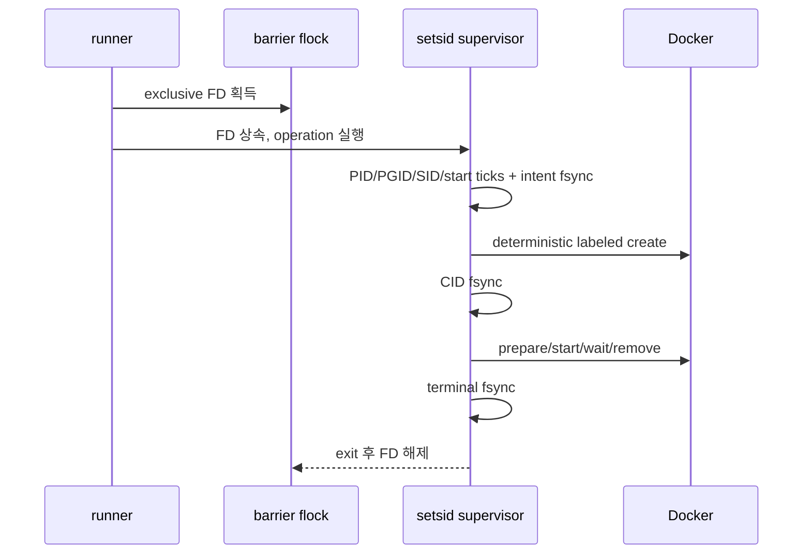

# T-VN-04A·15·58 n150 targeted live 인수 설계

## 1. 목적과 PR 경계

PR #792는 issue #741, #785와 `T-VN-15`의 마지막 production 증거만 소유한다. 세 기능의
API/UI 구현은 이미 integration을 거쳐 main에 들어왔으므로 제품 경로를 다시 설계하지 않고,
실제 배포 조합에서 owned fixture·browser BFF·복구를 끝까지 증명한다.

- strict `T-ADM-C7` runner에는 Feature mutation을 추가하지 않는다.
- 새 lane은 C7 host attestation v3와 compatible-pair v4를 read-only로 재검증한 뒤 별도
  `BLOCKED.json`, `ACTIVE.json`, evidence root를 사용한다.
- `E2E_LIVE_ALLOW_PROD=1`과 `E2E_ADMIN_FEATURE_ACCEPTANCE_WRITE=1`을 동시에 요구하며
  Playwright worker/retry는 1/0이다.
- run별 Feature ID 8개만 소유한다. 기존 운영 row, 공개 row, 임의 weather/price row를
  fixture로 빌리지 않는다.
- 구현 exact head를 단일 적대적 리뷰어가 승인하기 전에는 test·lint·build·parser를 실행하지
  않는다. 승인 뒤 WSL에서 SSH로 n150 production에 접속해 파괴적 live lane을 실행한다.

## 2. 배포·secret attestation

targeted runner 자체의 source 신뢰는 commit별 root snapshot 4파일과 exact manifest로 고정한다.
실제 배포 신뢰는 root-owned C7 verifier를 호출해 다음을 비교한다.

- host machine/hostname, compose project, 공개 UI/API/Dagster origin hash
- compatible pair active의 Map API/UI/Dagster web/daemon, PinVi API image ID와 source revision
- 다섯 service의 actual command/environment hash와 건강 상태
- exact Playwright executor image와 source revision
- Map API에만 존재하는 production cursor signing secret의 중복 없음·길이·공백·credential 분리

cursor 값은 출력하지 않는다. Map UI, Dagster web/daemon, PinVi API에 같은 env name이 하나라도
있으면 mutation 전에 실패한다. exact API image를 network 없이 별도 생성해 cursor secret만
누락한 production 설정이 Alembic 전에 generic error와 exit 1로 닫히는 것도 증명한다. probe는
DB와 기존 runtime을 변경하지 않고 종료·삭제되며 enum 결과만 root evidence에 남긴다.

## 3. #785 stale correction

owned active `place`를 add 요청과 승인으로 만든 뒤 다음 순서를 실제 UI와 BFF에서 검증한다.

1. `/revision` response header의 raw strong `ETag`와 detail revision으로 편집 basis를 만든다.
2. 운영자 name/reason dirty draft를 입력한다.
3. 별도 BFF PATCH가 같은 baseline `If-Match`로 competing change request를 만들고 승인한다.
4. UI submit이 최초 basis의 raw `If-Match`를 그대로 전송해 412를 받는지 wire에서 확인한다.
5. dirty draft·conflict UI가 유지되고 자동 refetch/retry/PATCH가 더 생기지 않음을 확인한다.
6. `최신값으로 폼 다시 불러오기` 뒤에만 competing value와 새 ETag basis가 적용되는지 확인한다.
7. 새 basis를 쓰는 재요청이 200/pending인지 확인하고 fixture request는 reject한다.

cleanup은 매번 직전 `/revision` header의 ETag로 delete request를 만들고 승인한다. 최초 ETag,
JS number로 재구성한 revision, 테스트 메모리 snapshot을 재사용하지 않는다.

## 4. #741 비공개 Feature

admin API로 `draft`, `inactive`, `hidden` place를 각각 만들고 승인한다. 각 상태에 대해 admin
exact-status bbox와 실제 지도 marker/detail 상태를 확인한다. public detail은 404여야 하며,
owned 좌표 주위의 좁은 public bbox가 `mode=items`, `truncated=false`, 반환 수가 limit보다 작은
조건에서도 ID를 포함하지 않아야 한다. 이 선행 조건은 unrelated public row가 limit을 채워
숨김 ID의 누출을 가리는 false-green을 막는다.

admin API가 만들 수 없는 hidden weather/price는 exact API image의 standalone helper가
DB transaction으로 Feature 2개와 value 각 1개를 만든다. API runtime environment는 unique
memory map과 Docker child env로만 전달하고 디스크 env snapshot·argv 값·journal 값은 만들지 않는다.
browser는 admin exact-kind bbox,
card target identity·non-empty metric/history, UI panel의 실제 값과 error DOM 부재를 확인하고,
public detail/card/bbox 404·미포함을 함께 단언한다.

direct cleanup은 두 parent의 kind/name/category/status/coordinate/data-origin 및 child value
fingerprint를 확인한다. `SELECT ... FOR UPDATE` parent·기존 child lock을 잡은 같은 transaction에서
`pg_catalog.pg_constraint`로 발견한 모든 child FK를 audit하고 parent를 삭제해 late child
insert를 막는다. 이후 direct counts 0/0/0과 FK references 0을 다시 확인한다.

## 5. T-VN-15 search total·cursor

같은 유일 검색어를 이름에 포함하되 ID가 다른 active place alpha/beta 2개를 생성·승인한다.
각 create idempotency key는 `SHA256(feature_id)`로 만들어 두 요청의 충돌을 막는다. browser는
public key query가 아닌 same-origin `/api/proxy/v1/features/search`만 사용한다.

| 시나리오 | 필수 결과 |
|---|---|
| `q`, `page_size=1`, `include_total=false` 첫 page | item 1, `total=null`, non-empty cursor |
| 같은 query continuation | 다른 owned ID 1, `total=null` |
| `include_total=true` 첫 page | item 1, `total=2`, non-empty cursor |
| 같은 query continuation | 다른 owned ID 1, `total=2` |
| cursor의 `q`만 변경 | 422 problem+json, `CURSOR_QUERY_MISMATCH` |
| cursor의 `include_total`만 변경 | 422 problem+json, `CURSOR_QUERY_MISMATCH` |
| payload segment 한 글자 변조·원 signature 유지 | 422 problem+json, `FEATURE_SEARCH_CURSOR_TAMPERED` |

문제 응답은 원 cursor와 변조 cursor를 포함하지 않아야 한다. redacted reporter도 response body,
assertion value, URL, cursor를 기록하지 않는다.
normal과 recovery-only cleanup의 마지막에는 같은 exact query를 `include_total=true`로 다시 읽어
`items=[]`, `total=0`, next cursor null/absent를 typed response에서 확인한다.

## 6. SIGKILL·복구 모델

첫 적대 리뷰는 runner가 `docker compose exec` 또는 `docker create` 도중 SIGKILL되면 recovery
clear 뒤 늦은 seed/container가 생길 수 있는 P1을 확인했다. 최종 설계는 영구 tombstone 대신
다음 barrier/supervisor 프로토콜을 사용한다.

runner만 SIGKILL되면 supervisor는 barrier를 유지한 채 한 operation을 종결한다. recovery는 barrier
획득 뒤 dead supervisor의 terminal ACTIVE를 요구하고 exact label/name/CID를 대조해 drain한다.
runner와 supervisor가 함께 사라져 terminal이 없으면 cgroup/OOM/daemon ambiguity로 간주해 자동
clear하지 않는다. BLOCKED를 유지하고 daemon restart 또는 host reboot로 late work가 없음을
운영자가 확정해야 한다.

각 정상 operation은 `claim-pending`, `created`, `prepared`, `start-pending`, `started`, `exited`,
`removed`, `terminal` 8개 exact phase를 갖는다. normal evidence는 probe, seed helper, main/recovery
executor, cleanup/audit helper의 6×8 events를, recovery evidence는 3×8 events를 요구한다. raw
container identity는 ACTIVE에만 있고 보존 lifecycle에는 hash만 있다.

Playwright raw `test-results`는 evidence bind 밖 container `/tmp` tmpfs로 분리한다. main/recovery
evidence subtree는 root-owned `c7-summary.json`, `c7-results.xml`, `c7-summary.html` 세 regular
file만 허용하고 JSON/XML/HTML의 exact redacted schema·spec 2건·passed content를 검증한 뒤 fsync한다.

## 7. 완료 기준

1. PR #792 exact implementation/docs head를 단일 적대적 리뷰어가 P0~P3 없음으로 승인한다.
2. 그 뒤 static/unit/frontend/build 및 관련 repository/attestation gate를 실행한다.
   exact-tree PostgreSQL regression에서 `include_total=false`의 COUNT statement 0회와
   `include_total=true`의 COUNT statement 1회를 함께 증명한다. live HTTP total 값만으로 이
   실행 횟수를 추정하지 않는다.
3. CI green과 exact 배포 commit/image/attestation을 확인한다.
4. WSL에서 n150 production에 SSH로 접속해 targeted lane을 실행한다.
5. API pending 0, API-owned deleted/public 0, direct 0/0/0, FK reference 0,
   Docker label/name 0, BLOCKED/ACTIVE 없음, exact evidence fsync를 확인한다.
6. redacted live 결과를 #741/#785와 T-VN-15 추적에 남기고 두 issue를 닫는다.

운영 명령, snapshot mode, catastrophic recovery 판단, evidence 판정은
[targeted runbook](../runbooks/admin-feature-live-acceptance.md)을 정본으로 한다.
